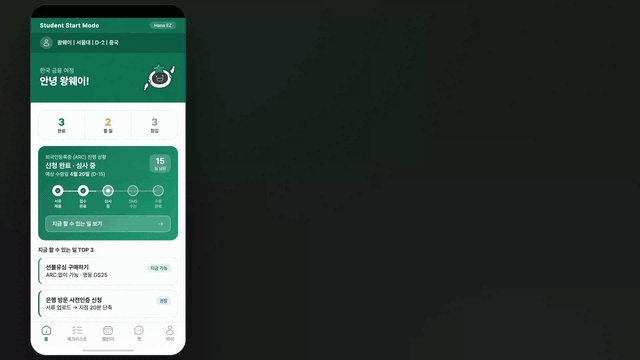

# Hana EZ Student Start Mode 데모



외국인 유학생의 입국 초기 금융 준비 과정을 보여주는 발표용 HTML 데모입니다. 최종본은 `demo_88s_euna.html`을 기준으로 정리했고, 루트의 `demo.html`도 같은 최종본을 가리키도록 맞춰 두었습니다.

## 최종 산출물

| 구분 | 파일 | 설명 |
| --- | --- | --- |
| 최종 HTML | [demo.html](demo.html) | 발표/녹화용 기본 진입 파일 |
| 보관용 HTML | [demo_88s_euna.html](demo_88s_euna.html) | 최종본 원본 이름을 유지한 동일 HTML |
| 최종 MP4 | [output/video/demo_88s_euna_final.mp4](output/video/demo_88s_euna_final.mp4) | 4K H.264 + AAC 발표 영상 |
| README GIF | [output/video/demo_88s_euna_preview.gif](output/video/demo_88s_euna_preview.gif) | 전체 흐름을 빠르게 훑는 미리보기 |
| 오디오 이벤트 | [docs/audio/demo_88s_euna_audio_events.md](docs/audio/demo_88s_euna_audio_events.md) | 효과음 타임코드와 역할 |
| 오디오 소스 | [docs/audio/demo_88s_euna_audio_sources.md](docs/audio/demo_88s_euna_audio_sources.md) | 배경음악/효과음 출처와 로컬 파일 |

## 실행 방법

로컬에서 바로 확인하려면 루트에서 아래 명령을 실행한 뒤 브라우저에서 접속하면 됩니다.

```bash
python3 -m http.server 8000
```

```text
http://localhost:8000/demo.html?mode=short
```

HTML 파일을 직접 열어도 대부분 동작하지만, 이미지와 폰트 로딩을 안정적으로 보려면 로컬 서버로 확인하는 편이 좋습니다.

## 파일 구조

```text
.
├── demo.html
├── demo_88s_euna.html
├── archive/
│   └── html/
├── imgs/
│   ├── greet.png
│   └── star.png
├── docs/
│   └── audio/
│       ├── demo_88s_euna_audio_events.md
│       └── demo_88s_euna_audio_sources.md
└── output/
    ├── audio_work/
    │   └── free_mixkit_65s/
    └── video/
        ├── demo_88s_euna_final.mp4
        └── demo_88s_euna_preview.gif
```

기존 실험 HTML은 `archive/html`로 옮겨 두었습니다. 발표에 사용할 기준 파일은 위 표의 최종 산출물입니다.

## 영상 정보

- 길이: 약 87초
- 해상도: 3840 x 2160
- 프레임레이트: 25fps
- 비디오 코덱: H.264
- 오디오 코덱: AAC
- 배경음악: `Corporate Piano`

## 사운드 구성

배경음악은 `Corporate Piano`를 사용했고, 효과음은 Mixkit 기반 UI 사운드로 구성했습니다. 주요 효과음은 버튼 클릭, 탭 전환, 채팅 입력, 푸시 알림, 체크리스트 업데이트, 출처 표시 구간에만 배치했습니다.

상세한 출처와 타임코드는 아래 문서에서 확인할 수 있습니다.

- [오디오 소스 문서](docs/audio/demo_88s_euna_audio_sources.md)
- [오디오 이벤트 맵](docs/audio/demo_88s_euna_audio_events.md)
